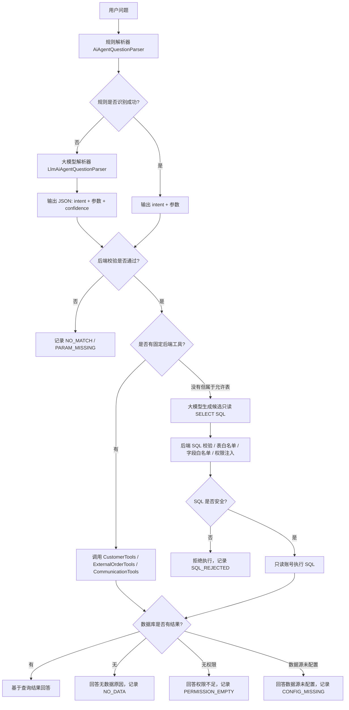

# AI Agent 大模型接入方案

## 目标

将客户经营智能体从“关键词规则问答”升级为“规则解析 + 大模型语义解析 + 后端受控工具查询”的混合架构。

核心原则：

| 原则 | 说明 |
|---|---|
| 大模型负责理解语义 | 识别用户意图，抽取客户名、销售名、时间范围、订单状态等参数 |
| 后端负责查询数据库 | 所有客户、合同、订单、跟进数据必须来自后端工具查询结果 |
| 允许生成受控只读 SQL | 大模型可以生成候选 `SELECT` SQL，但必须由后端校验、加权限、用只读账号执行 |
| 不允许编造数据 | 数据库没有、权限没有、数据源没配置时，必须明确说明原因 |
| 权限必须后端控制 | 大模型不能决定用户能看什么，权限仍由现有后端数据权限控制 |
| 回答必须可追溯 | 每次回答应记录 intent、参数、工具、数据源、查询结果状态 |

## 当前问题

现在智能体主要靠规则判断，例如：

```text
用户问题
  ↓
关键词判断
  ↓
字符串截取客户名 / 销售名
  ↓
调用后端工具
  ↓
返回答案
```

这种方式能处理固定问法，但对自然语言不稳定。

示例：

| 用户问题 | 当前可能结果 |
|---|---|
| DAISY 的合同有哪些？ | 可以识别客户名 DAISY |
| DAISY 签订的合同有哪些？ | 可能错误识别为客户名 DAISY签订 |
| 小郑这个月负责客户的新订单有哪些？ | 依赖关键词是否刚好命中 |
| 帮我看看最近需要关注的高金额客户 | 容易漏掉意图或参数 |

根本问题不是“缺少某几个问法”，而是系统缺少统一的问题理解层。

## 推荐架构

```text
用户问题
  ↓
规则解析器
  ↓ 规则能识别
直接输出 intent + 参数
  ↓
后端校验
  ↓
调用受控工具查询数据库
  ↓
生成答案

用户问题
  ↓
规则解析器
  ↓ 规则识别不了 / 置信度低
大模型解析器
  ↓
只输出 intent + 参数
  ↓
后端校验
  ↓
调用受控工具查询数据库
  ↓
基于数据库结果生成答案
```

Mermaid 流程图：



## 大模型允许做什么

| 能做 | 说明 |
|---|---|
| 理解用户语义 | 判断用户想查客户、合同、订单、跟进、沟通、负责人等 |
| 抽取参数 | 抽取客户名、销售名、关键词、订单号、产品名、时间范围 |
| 归一化问法 | 将“签订的合同”“下过的订单”“合同有哪些”归到同一个 intent |
| 判断问题是否模糊 | 例如“帮我看看 DAISY”需要追问用户想看合同、基础信息还是跟进 |
| 生成候选只读 SQL | 当没有固定工具但问题属于允许查询范围时，可以生成 `SELECT` SQL 交给后端校验 |
| 根据工具结果组织语言 | 可以把数据库返回结果总结成自然语言和表格说明 |

## 大模型不允许做什么

| 禁止项 | 原因 |
|---|---|
| 直接执行 SQL | SQL 必须由后端校验后执行，模型不能自己执行 |
| 生成写入 SQL | 禁止 `INSERT`、`UPDATE`、`DELETE`、`DROP`、`ALTER`、`TRUNCATE` 等 |
| 直接连接数据库 | 所有查询必须经过后端权限、表白名单、字段白名单和审计 |
| 编造客户、合同、订单 | 业务数据必须来自数据库查询结果 |
| 绕过权限回答 | 用户没有权限的数据不能返回 |
| 自己创造 intent | intent 必须来自后端白名单 |
| 无授权返回聊天正文或邮件正文 | 正文可返回，但必须满足角色授权、数据范围、脱敏和审计要求 |
| 暴露密码、token、授权码 | 敏感信息必须拒绝返回 |

## 大模型“读取数据库”的正确方式

不是让大模型直接访问数据库，而是让它通过后端工具或受控只读 SQL 读取数据库结果。

```text
大模型理解问题
  ↓
输出：
{
  "intent": "CUSTOMER_CONTRACT_STATUS_LIST",
  "customerName": "DAISY"
}
  ↓
后端校验 intent 是否允许
  ↓
后端根据当前用户权限调用 ExternalOrderTools
  ↓
工具返回数据库结果
  ↓
大模型或模板基于结果生成回答
```

这样既能利用大模型理解语义，又不会让它越权或胡编。

如果问题没有对应固定工具，但属于允许查询范围，可以走受控 SQL 路径：

```text
用户问题
  ↓
大模型理解语义
  ↓
生成候选 SELECT SQL
  ↓
后端校验 SQL
  ↓
后端注入权限条件和 LIMIT
  ↓
只读数据库账号执行
  ↓
把查询结果返回给大模型或模板
  ↓
基于真实查询结果回答
```

必须区分：

| 情况 | 处理方式 |
|---|---|
| 问题库没有这个问法 | 大模型可以理解语义，选择工具或生成候选只读 SQL |
| 后端没有对应工具，但表在白名单内 | 可以走受控只读 SQL |
| 表不在白名单内 | 拒绝查询，记录 SQL_REJECTED |
| 数据库没有业务数据 | 明确回答无数据，不能编造 |

## 受控只读 SQL 规则

大模型可以生成候选 SQL，但 SQL 只是“草稿”，不能直接执行。

```text
候选 SQL
  ↓
SQL 安全解析
  ↓
只允许 SELECT
  ↓
校验表白名单和字段白名单
  ↓
禁止危险函数和子句
  ↓
注入当前用户权限条件
  ↓
强制 LIMIT
  ↓
只读账号执行
```

SQL 限制：

| 限制 | 要求 |
|---|---|
| SQL 类型 | 只允许 `SELECT` |
| 写操作 | 禁止 `INSERT`、`UPDATE`、`DELETE`、`DROP`、`ALTER`、`TRUNCATE`、`CREATE` |
| 多语句 | 禁止分号多语句 |
| 表范围 | 只能访问白名单表 |
| 字段范围 | 只能访问白名单字段 |
| 数据量 | 必须有 `LIMIT`，后端可强制覆盖 |
| 权限 | 必须追加当前用户权限过滤条件 |
| 执行账号 | 必须使用数据库只读账号 |
| 审计 | 必须记录原始问题、模型 SQL、最终 SQL、执行人、结果条数 |

建议第一阶段允许表：

| 表 | 用途 |
|---|---|
| customer | 客户基础信息 |
| follow_up_record | 跟进记录 |
| wecom_ingestion_message | 企微消息统计，正文按授权控制 |
| email_webhook_event | 邮件事件统计，正文按授权控制 |
| mls_agent_data.contract_info | 外部订单/合同 |

不建议第一阶段开放：

| 表 | 原因 |
|---|---|
| sys_user 敏感字段 | 可能包含账号、认证信息 |
| 权限配置表 | 容易暴露系统权限结构 |
| token / auth / credential 相关表 | 明确敏感 |
| 任意业务扩展表 | 字段含义和权限边界不清楚 |

SQL 审计建议记录：

| 字段 | 说明 |
|---|---|
| user_id | 提问用户 |
| organization_id | 组织 |
| raw_question | 原始问题 |
| parser_source | RULE / LLM / SQL |
| generated_sql | 模型生成的候选 SQL |
| executed_sql | 后端校验和改写后的 SQL |
| allowed_tables | 涉及表 |
| result_count | 返回行数 |
| status | SUCCESS / SQL_REJECTED / NO_DATA / ERROR |
| create_time | 时间 |

## 解析结果格式

建议大模型只返回 JSON，不返回解释文字。

```json
{
  "intent": "CUSTOMER_CONTRACT_STATUS_LIST",
  "customerName": "DAISY",
  "specialistName": null,
  "keyword": null,
  "orderNo": null,
  "productName": null,
  "timeRange": "month",
  "activeOnly": false,
  "sqlRequired": false,
  "candidateSql": null,
  "confidence": 0.92,
  "needClarification": false,
  "clarificationQuestion": null
}
```

字段说明：

| 字段 | 说明 |
|---|---|
| intent | 后端支持的能力标识，必须来自白名单 |
| customerName | 客户名、客户简称、客户关键词 |
| specialistName | 销售、负责人、联系专员名称 |
| keyword | 模糊搜索关键词 |
| orderNo | 订单号 |
| productName | 产品名称 |
| timeRange | 时间范围，例如 `7d`、`month`、`quarter`、`year` |
| activeOnly | 是否只查进行中/未结束订单 |
| sqlRequired | 是否需要走受控只读 SQL |
| candidateSql | 大模型生成的候选只读 SQL，只有 `sqlRequired=true` 时允许存在 |
| confidence | 模型对解析结果的置信度 |
| needClarification | 是否需要追问 |
| clarificationQuestion | 需要追问时的问题 |

## Intent 白名单

第一阶段只开放已有工具能力，不开放任意查询。

| intent | 说明 | 后端工具 |
|---|---|---|
| CUSTOMER_CONTRACT_STATUS_LIST | 查询客户合同/订单 | ExternalOrderTools |
| CUSTOMER_NEW_ORDER_CHECK | 查询客户新订单 | ExternalOrderTools |
| CUSTOMER_ACTIVE_ORDER_LIST | 查询客户进行中订单 | ExternalOrderTools |
| SALES_CUSTOMER_NEW_ORDER_CHECK | 查询销售负责客户的新订单 | ExternalOrderTools |
| SALES_CUSTOMER_ACTIVE_ORDER_LIST | 查询销售负责客户进行中订单 | ExternalOrderTools |
| SALES_RECENT_ORDER_LIST | 查询销售负责客户最近订单 | ExternalOrderTools |
| CUSTOMER_NAME_SEARCH | 按客户名称模糊搜索 | CustomerTools |
| CUSTOMER_SUMMARY | 查询客户基础信息 | CustomerTools |
| SPECIALIST_CUSTOMER_LIST | 查询销售负责客户 | CustomerTools |
| CUSTOMER_OWNER_LOOKUP | 查询客户负责人 | CustomerTools |
| CUSTOMER_FOLLOW_RECORD_LIST | 查询客户跟进记录 | AiAgentInternalMapper |
| CUSTOMER_COMMUNICATION_SUMMARY | 查询客户沟通统计 | CommunicationTools |
| SPECIALIST_COMMUNICATION_SUMMARY | 查询销售客户沟通统计 | CommunicationTools |

后端必须校验：

```text
如果 intent 不在白名单：
  拒绝执行
  记录 NO_MATCH
```

## 回答生成规则

回答必须基于工具返回结果。

| 查询结果 | 回答方式 |
|---|---|
| 有数据 | 总结数据，并展示明细表格 |
| 没数据 | 明确说明数据库未匹配到结果 |
| 没权限 | 说明当前账号权限范围内未找到 |
| 数据源未配置 | 说明外部订单/合同数据源未配置 |
| 参数不清楚 | 追问用户补充客户名、销售名或时间范围 |
| intent 不支持 | 说明当前智能体暂不支持该类问题，并记录 |
| SQL 被拒绝 | 说明当前问题不能通过开放查询能力回答，并记录原因 |

禁止回答：

```text
可能有 3 个合同
应该是朱丽丽负责
客户大概率存在
我猜这个订单已经完成
```

正确回答：

```text
当前权限范围内，未找到名称匹配“DAISY签订”的客户。
建议检查客户名称，或使用客户名称关键词搜索。
```

或者：

```text
客户“埃及Sky trading(daisy)”在外部 contract_info 表中匹配到 30 条合同/订单记录。
下面展示前 10 条。
```

## 无数据和未回答的区分

必须区分“不会回答”和“能查但查不到”。

| 状态 | 含义 | 记录位置 |
|---|---|---|
| NO_MATCH | 没识别出用户意图 | ai_agent_unanswered_question |
| PARAM_MISSING | 缺少客户名、销售名等关键参数 | ai_agent_unanswered_question |
| NO_DATA | 识别成功并查询，但数据库没有结果 | 建议记录到 ai_agent_unanswered_question 或新增查询审计表 |
| PERMISSION_EMPTY | 当前权限下查不到 | 建议记录 |
| CONFIG_MISSING | 外部数据源未配置 | 建议记录 |
| ANSWERED | 成功回答 | ai_agent_answerable_question 更新命中 |

建议后续补充一个更准确的审计表：

```text
ai_agent_query_audit
```

用于记录每次查询的 intent、参数、工具、数据源、结果数量、失败原因。

## 权限控制

大模型不能参与权限判断。

权限控制必须在后端工具中完成：

| 数据 | 权限来源 |
|---|---|
| 客户 | CUSTOMER_MANAGEMENT_READ |
| 合同/订单 | CONTRACT_READ |
| 跟进记录 | 当前用户客户权限 |
| 企微/邮件统计 | 当前用户可见客户范围 |

回答时必须使用当前账号的数据范围：

| 数据范围 | 含义 |
|---|---|
| ALL | 全公司权限范围 |
| DEPARTMENT | 我的团队权限范围 |
| SELF | 仅本人客户 |

## 聊天正文和邮件正文返回规则

聊天正文和邮件正文可以返回，但不能默认开放给所有人。

```text
用户请求查看正文
  ↓
识别正文查看意图
  ↓
校验用户角色和数据范围
  ↓
校验客户 / 员工 / 部门权限
  ↓
按配置决定是否脱敏
  ↓
记录审计日志
  ↓
返回正文或拒绝说明
```

建议规则：

| 规则 | 说明 |
|---|---|
| 默认关闭 | 配置未开启时，只返回统计，不返回正文 |
| 角色授权 | 只有老板、管理员、销售主管等指定角色可查看 |
| 数据范围 | 只能查看当前账号权限范围内的客户和员工 |
| 审计必开 | 谁看了谁的聊天/邮件正文必须记录 |
| 默认脱敏 | 手机号、邮箱、token、授权码、附件链接等按规则脱敏 |
| 最小必要 | 默认只返回最近 N 条或指定时间范围内内容 |
| 明确来源 | 回答中说明来自企微消息或邮件事件 |

建议配置：

```properties
crm.ai-agent.message-body.enabled=false
crm.ai-agent.message-body.allowed-roles=admin,boss,sales_manager
crm.ai-agent.message-body.max-rows=20
crm.ai-agent.message-body.mask-sensitive=true
crm.ai-agent.message-body.audit-enabled=true
```

允许返回的正文类型：

| 类型 | 说明 |
|---|---|
| 企微聊天正文 | 仅授权角色、授权客户范围内返回 |
| 邮件正文 | 仅授权角色、授权客户范围内返回 |
| 跟进记录内容 | 按客户权限返回，可按配置脱敏 |

仍然禁止返回：

| 类型 | 说明 |
|---|---|
| 密码 | 永远禁止 |
| token / 授权码 | 永远禁止 |
| 无权限客户正文 | 永远禁止 |
| 无审计正文查看 | 永远禁止 |

## 防止大模型幻觉

必须做以下限制：

| 措施 | 说明 |
|---|---|
| JSON Schema 校验 | 模型输出不符合格式直接拒绝 |
| intent 白名单 | 只允许调用已实现工具 |
| SQL 白名单校验 | 候选 SQL 必须通过只读、表、字段、权限、LIMIT 校验 |
| 参数长度限制 | 防止 prompt 注入和异常输入 |
| 工具结果优先 | 回答只能使用工具返回数据 |
| 空结果明确回答 | 没查到就是没查到，不允许补全 |
| 引用数据源 | 回答中说明来自 customer / contract_info 等 |
| 日志审计 | 保存模型输入、输出、工具调用结果 |

## Prompt 模板

系统提示词建议：

```text
你是 CRM 智能体的问题解析器。
你只负责把用户问题解析成 JSON，不负责回答业务问题。

要求：
1. 不要编造客户、合同、订单、销售、金额、状态。
2. 优先从允许的 intent 中选择。
3. 如果没有合适 intent，但问题可以通过允许表查询，可以生成候选 SELECT SQL。
4. 候选 SQL 只能是 SELECT，不能包含写操作，不能访问非白名单表。
5. 不要要求直接访问数据库，SQL 只作为候选，由后端校验执行。
6. 如果不能确定 intent 或 SQL，返回 intent=null。
7. 如果缺少关键参数，设置 needClarification=true。
8. 只输出 JSON，不输出 Markdown，不输出解释。

允许的 intent:
- CUSTOMER_CONTRACT_STATUS_LIST
- CUSTOMER_NEW_ORDER_CHECK
- CUSTOMER_ACTIVE_ORDER_LIST
- SALES_CUSTOMER_NEW_ORDER_CHECK
- SALES_CUSTOMER_ACTIVE_ORDER_LIST
- SALES_RECENT_ORDER_LIST
- CUSTOMER_NAME_SEARCH
- CUSTOMER_SUMMARY
- SPECIALIST_CUSTOMER_LIST
- CUSTOMER_OWNER_LOOKUP
- CUSTOMER_FOLLOW_RECORD_LIST
- CUSTOMER_COMMUNICATION_SUMMARY
- SPECIALIST_COMMUNICATION_SUMMARY
```

用户消息示例：

```text
DAISY签订的合同有哪些？
```

期望输出：

```json
{
  "intent": "CUSTOMER_CONTRACT_STATUS_LIST",
  "customerName": "DAISY",
  "specialistName": null,
  "keyword": null,
  "orderNo": null,
  "productName": null,
  "timeRange": null,
  "activeOnly": false,
  "sqlRequired": false,
  "candidateSql": null,
  "confidence": 0.92,
  "needClarification": false,
  "clarificationQuestion": null
}
```

## 后端实现建议

建议新增模块：

| 类 | 作用 |
|---|---|
| AiAgentLlmProperties | 大模型配置 |
| AiAgentLlmClient | 调用大模型接口 |
| LlmAiAgentQuestionParser | 大模型问题解析器 |
| AiAgentQuestionParseService | 统一解析入口：先规则，后大模型 |
| AiAgentIntentValidator | 校验 intent 和参数 |
| AiAgentSqlQueryService | 校验、改写、执行受控只读 SQL |
| AiAgentSqlGuard | SQL 类型、表、字段、危险语句校验 |
| AiAgentQueryAuditService | 记录解析、工具调用、结果状态 |

现有模块关系：

```text
AiAgentChatService
  ↓
AiAgentQuestionParseService
  ↓
AiAgentQuestionParser            规则解析
LlmAiAgentQuestionParser         大模型解析
  ↓
AiAgentIntentValidator
  ↓
CustomerTools / ExternalOrderTools / CommunicationTools
  ↓
AiAgentSqlQueryService           无固定工具时的受控只读 SQL 查询
```

## 配置项建议

```properties
crm.ai-agent.llm.enabled=false
crm.ai-agent.llm.base-url=
crm.ai-agent.llm.api-key=
crm.ai-agent.llm.model=
crm.ai-agent.llm.timeout-seconds=10
crm.ai-agent.llm.min-confidence=0.75
crm.ai-agent.llm.max-input-length=1000
crm.ai-agent.llm.max-retry=1

crm.ai-agent.sql.enabled=false
crm.ai-agent.sql.max-rows=100
crm.ai-agent.sql.allowed-tables=customer,follow_up_record,wecom_ingestion_message,email_webhook_event,mls_agent_data.contract_info
crm.ai-agent.sql.audit-enabled=true

crm.ai-agent.message-body.enabled=false
crm.ai-agent.message-body.allowed-roles=admin,boss,sales_manager
crm.ai-agent.message-body.max-rows=20
crm.ai-agent.message-body.mask-sensitive=true
crm.ai-agent.message-body.audit-enabled=true
```

默认 `enabled=false`，上线前通过配置逐步打开。

## 接入步骤

| 阶段 | 任务 | 验收标准 |
|---|---|---|
| 1 | 保留现有规则解析器 | 当前已支持问题不受影响 |
| 2 | 新增 LLM 配置和 Client | 能调用模型并拿到 JSON |
| 3 | 新增 LLM 解析器 | 规则识别不了时能输出 intent + 参数 |
| 4 | 增加白名单校验 | 非法 intent 不执行 |
| 5 | 接入后端工具 | 查询仍走现有权限和工具 |
| 6 | 增加受控只读 SQL | 无固定工具但属于允许表的问题，可以校验后查询 |
| 7 | 增加正文查看受控能力 | 授权角色可查看聊天/邮件正文，必须审计 |
| 8 | 增加查询审计 | 能区分 ANSWERED / NO_DATA / NO_MATCH / SQL_REJECTED |
| 9 | 小范围灰度 | 只对测试账号开启 |
| 10 | 评估问题集 | 用真实问法验证准确率 |

## 测试用例

| 用户问题 | 期望 intent | 期望参数 |
|---|---|---|
| DAISY的合同有哪些？ | CUSTOMER_CONTRACT_STATUS_LIST | customerName=DAISY |
| DAISY签订的合同有哪些？ | CUSTOMER_CONTRACT_STATUS_LIST | customerName=DAISY |
| DAISY签过哪些订单？ | CUSTOMER_CONTRACT_STATUS_LIST | customerName=DAISY |
| 小郑负责的客户这个月有没有新订单？ | SALES_CUSTOMER_NEW_ORDER_CHECK | specialistName=小郑,timeRange=month |
| 客户名称里包含印尼的客户 | CUSTOMER_NAME_SEARCH | keyword=印尼 |
| 我名下有哪些客户？ | VISIBLE_CUSTOMER_LIST | dataScope=SELF 或当前请求范围 |
| DAISY最近有哪些跟进记录？ | CUSTOMER_FOLLOW_RECORD_LIST | customerName=DAISY |
| 张三这个月和客户沟通情况怎么样？ | SPECIALIST_COMMUNICATION_SUMMARY | specialistName=张三,timeRange=month |

## 风险和处理

| 风险 | 处理 |
|---|---|
| 模型输出非法 JSON | 丢弃模型结果，走 fallback |
| 模型返回未知 intent | 拒绝执行，记录 NO_MATCH |
| 模型置信度低 | 追问用户或走 fallback |
| 客户名模糊 | 先查客户候选，多个候选时让用户选择 |
| 数据源无结果 | 回答 NO_DATA，不编造 |
| 数据源未配置 | 回答 CONFIG_MISSING |
| 响应慢 | 设置超时，超时后回退规则 |
| 成本过高 | 规则优先，只有低置信度时调用模型 |
| prompt 注入 | 用户问题只作为待解析文本，模型不能执行用户指令 |
| SQL 越权 | SQL 必须后端解析、白名单校验、权限注入和只读账号执行 |
| 正文泄露 | 正文能力默认关闭，只给授权角色开放，并强制审计 |

## 最终目标

接入大模型后，智能体应该达到：

| 能力 | 目标 |
|---|---|
| 同义问法理解 | 不再靠不断补问法维护 |
| 参数抽取 | 更准确抽取客户、销售、时间、订单状态 |
| 数据真实性 | 所有业务数据来自数据库工具 |
| 权限安全 | 不绕过现有权限 |
| 灵活查询 | 无固定工具时，可通过受控只读 SQL 查询允许范围内的数据 |
| 正文查看 | 授权用户可查看聊天/邮件正文，普通用户默认只能看统计或脱敏信息 |
| 可审计 | 每次回答能追踪解析结果和工具调用 |
| 可扩展 | 后续新增能力时只新增 intent 和工具，不堆问法 |
