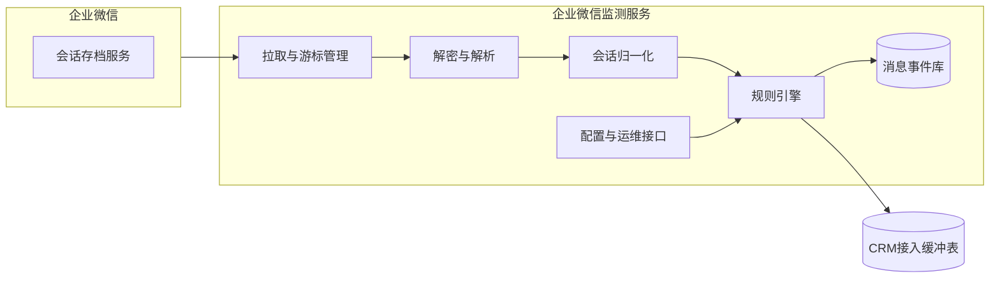
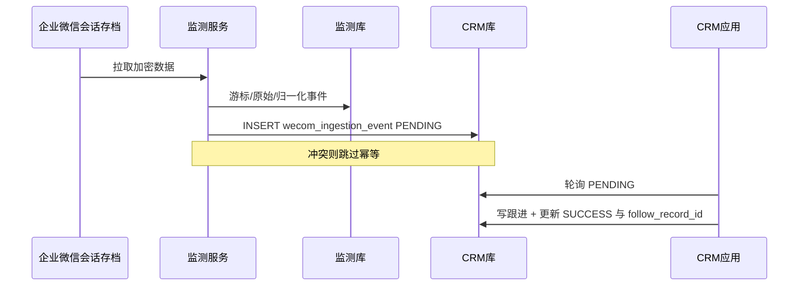

# 企业微信监测系统设计方案

> 本文档描述「企业微信消息监测」能力及**数据库分层设计**（监测侧库表 + CRM 侧接入缓冲表）。  
> **在 CRM 中自动创建跟进记录的具体业务逻辑**（客户匹配、负责人解析、`FollowUpRecordService` 调用等）建议后续单独迭代，可与现有邮件 `email_webhook_event` 消费模式对齐。  
> 架构风格可参考仓库内《邮箱监测系统接入 CRM 实施方案》：独立监测服务 + 清晰数据契约；与邮件方案差异在于：除 Webhook JSON 外，**推荐由监测服务向 CRM 库「接入缓冲表」直接写入归一化事件**，由 CRM 定时或异步任务消费。

---

## 1. 背景与目标

### 1.1 业务目标

在企业已使用企业微信、且联系专员已通过企业微信与客户沟通的前提下，建设一套**监测系统**，用于识别并记录：

- 指定联系专员（企业成员）是否通过企业微信**向客户发送了消息**；
- 同时覆盖 **单聊（专员 ↔ 外部联系人）** 与 **群聊（含客户的客户群等场景）**。

系统输出应为**可查询、可审计、可扩展**的消息事件流（或等价结构化数据），为后续「自动跟进」等业务能力提供事实来源。

### 1.2 重要前提说明（避免与「已授权登录」混淆）

企业微信常见的「扫码登录 / OAuth 授权」用于**身份认证与部分开放能力**，**并不等同于**企业已获得「可读取专员与客户之间聊天内容」的权限。

若要稳定、合规地获知「专员是否给客户发了消息、发了什么、何时发的」，在企业微信体系内，主流方案是开通并使用官方能力 **「会话内容存档」**（不同行业版本在接口形态上略有差异，下文统称「会话存档」）。  
若未开通会话存档，通常**无法**仅凭现有登录授权拿到完整的单聊/群聊消息明细。

> 实施前需由企业管理员在管理后台确认：是否已购买并开通会话存档、存档范围是否覆盖目标专员、合规告知是否到位。

---

## 2. 企业微信侧能力选型

### 2.1 推荐方案：会话内容存档（主数据通道）

**适用场景**：需要获知消息方向、发送者、接收方/群、时间、类型及内容（在策略允许范围内），并区分单聊与群聊。

**特点概要**：

- 由企业微信服务端按策略产生存档数据，监测系统通过官方接口**拉取 / 同步**（具体以当前企业版本文档为准）；
- 消息多为**加密形态**，企业需配置密钥材料，在本地解密后方可做规则判断与落库；
- 存档成员范围、消息类型、外部联系人可见性等均以**管理后台配置 + 官方接口返回**为准。

### 2.2 不推荐作为「主通道」的替代手段（仅作边界认知）

| 手段 | 说明 |
|------|------|
| 仅客户联系相关回调 / 事件 | 多面向客户资产变更、入群退群等，**难以**完整覆盖「每一条已发送消息内容」的监测诉求。 |
| 应用机器人被动收消息 | 仅当客户与机器人会话时有效，**不能**替代专员个人对客户的沟通监测。 |
| 非官方协议 / 客户端 Hook | 合规与稳定性风险极高，**不建议**。 |

结论：**以会话存档为主通道**设计监测系统，其它能力仅作辅助（如客户 ID 与外部联系人资料的补充查询）。

---

## 3. 总体架构建议

与邮箱监测类似，建议 **独立「企业微信监测服务」**，与 CRM 主应用分离部署。

**模块职责简述**：

1. **拉取与游标管理**：按官方建议维护同步游标（如 `seq` / `cursor` 等，以文档为准），支持断点续拉、限速与重试。  
2. **解密与解析**：使用企业配置的私钥与官方 SDK/算法解密，还原结构化字段。  
3. **会话归一化**：将单聊、群聊、不同消息类型映射为统一的「消息事件」模型。  
4. **规则引擎**：筛选「发送者为被监测专员」且「接收方为客户侧账号/客户群」的事件。  
5. **消息事件库**：持久化原始与归一化结果，支撑查询、对账与排障。  
6. **CRM 接入缓冲表**（位于 CRM 数据库）：写入待 CRM 消费的「外发事实」行；**不**由监测服务直接写跟进主表（详见第 5 节）。  
7. **配置与运维**：专员名单、企业主体、密钥轮换、告警与监控指标。

---

## 4. 单聊与群聊的监测语义

### 4.1 单聊（专员 → 客户）

**判定要点**（逻辑层面，字段名以实际解密 JSON 为准）：

- 会话类型为「与外部联系人的单聊」或等价标识；
- `from`（或发送方字段）为被监测专员的 `userid`；
- 对端为外部联系人身份（如 `external_userid` 等）。

**输出建议**：生成一条「外发消息事件」，至少包含：企业 ID、专员 `userid`、对端外部联系人标识、消息 ID、发送时间、消息类型、文本摘要（若有）、会话 ID。

### 4.2 群聊（专员在群内对客户发消息）

群场景需区分：

- **客户群**（外部客户与内部员工混合的典型业务群）；
- 纯内部群（若无外部客户，可按策略选择**忽略**或**单独标记**）。

**判定要点**：

- 会话类型为客户群 / 含外部成员的群聊（以接口为准）；
- `from` 为被监测专员；
- 群内存在至少一名外部联系人成员（若业务要求「必须 @ 客户」等，可在规则层追加，但属于业务策略而非通道能力）。

**输出建议**：在事件模型中增加 `roomid`（或等价群 ID）、群内外部成员列表快照（或引用 ID），便于后续与 CRM 客户群、客户资料对齐。

### 4.3 消息类型与媒体

除文本外，常见还有图片、语音、视频、文件、链接、名片、撤回等。  
监测系统的第一期可以：

- **全类型落库元数据**（发送者、时间、类型、引用 ID）；
- 文本可直接存摘要；媒体可先存**企业微信侧媒体 ID / SDK 拉取所需字段**，按需异步下载（注意磁盘与合规留存周期）。

---

## 5. 数据库设计

本节采用**推荐方案**：**监测服务自有库**承担高吞吐的拉取、解密、游标与排障；**CRM 数据库**内增加与 `email_webhook_event` 同类的**接入缓冲表**，由监测服务在规则命中后写入；**跟进主表及关联业务表仅由 CRM 应用写入**（后续通过定时任务、异步消费者或内部服务调用 `FollowUpRecordService` 等完成）。这样既避免依赖 HTTP JSON，又避免跨服务直接改核心业务表。

**DDL 脚本（仓库内仅保留两个文件）**：`wecom monitoring/docs/mysql_企业微信监测库.sql`（监测库 4 表）、`wecom monitoring/docs/mysql_cordys_crm_企业微信表.sql`（CRM 库 2 表）。

### 5.1 设计原则

| 原则 | 说明 |
|------|------|
| **职责分离** | 监测库：存档同步、解密、原始留痕、运维查询；CRM 库缓冲表：面向「一条待处理的客户沟通事实」、含幂等与消费状态。 |
| **幂等优先** | 同一企业微信消息在全链路只对应一条可识别的业务键；插入缓冲表使用「唯一约束 + 冲突忽略/更新」或先查后插。 |
| **最小写 CRM** | 监测服务对 CRM 库仅拥有**缓冲表（及可选「消息媒体」子表）**的 `INSERT`/`UPDATE` 权限，**无**跟进、客户等表的直连写权限。 |
| **与现有 CRM 模型对齐** | 缓冲表字段风格与 `email_webhook_event` 一致：含 `organization_id`、`status`、`follow_record_id`、`error_message` 等，便于共用「消费失败重试、人工补单」等运维习惯。 |

### 5.2 部署形态

**推荐（生产）**：监测服务独立数据库 + CRM 数据库；监测服务通过 JDBC 写入 CRM 缓冲表（内网、连接池、TLS 按环境要求配置）。

**极简（开发或小规模）**：监测与 CRM 共用同一 MySQL 实例，仍建议**不同 schema 或表前缀**区分监测运营表与 CRM 业务表，迁移脚本分仓库维护，避免耦合失控。

### 5.3 监测服务数据库（建议）

以下表由**企业微信监测服务**独占写入（CRM 不直接写这些表）。命名可按团队规范加前缀（如 `wcm_`）。

#### 5.3.1 `wecom_sync_checkpoint`（会话存档游标）

| 字段 | 类型建议 | 说明 |
|------|----------|------|
| `id` | `varchar(50)` PK | 主键 |
| `corp_id` | `varchar(64)` | 企业微信企业 ID |
| `checkpoint_type` | `varchar(32)` | 与官方同步方式一致的类型标识 |
| `last_seq` | `bigint` 可空 | 或 `last_cursor` / `last_msgid` 等，以官方为准 |
| `last_cursor` | `varchar(255)` 可空 | 与 `last_seq` 二选一或并存，视接口版本 |
| `create_time` / `update_time` | `bigint` | 与项目 `BaseModel` 时间戳风格一致 |

**索引**：`uk_corp_checkpoint`(`corp_id`, `checkpoint_type`)。

#### 5.3.2 `wecom_raw_message`（可选，排障与审计）

解密后的单条存档 JSON 或规范化 JSON，体积大时可仅存对象存储 key。

| 字段 | 类型建议 | 说明 |
|------|----------|------|
| `id` | PK | |
| `corp_id` | `varchar(64)` | |
| `wecom_msg_id` | `varchar(128)` | 官方消息唯一标识（若文档提供） |
| `seq` | `bigint` 可空 | 存档序列，便于对账 |
| `decrypted_payload` | `mediumtext` 或 OSS 路径 | 解密后内容或引用 |
| `create_time` | `bigint` | |

**索引**：`idx_corp_seq`、`uk_corp_msg`(`corp_id`, `wecom_msg_id`)（若官方保证唯一）。

#### 5.3.3 `wecom_message_event`（监测侧归一化事件）

规则引擎输出，供监测服务自身报表、重放、以及**组装写入 CRM 缓冲表**的源数据。

| 字段 | 类型建议 | 说明 |
|------|----------|------|
| `id` | PK | |
| `corp_id` | `varchar(64)` | |
| `wecom_msg_id` | `varchar(128)` | 幂等核心之一 |
| `sender_userid` | `varchar(128)` | 发送者 |
| `chat_type` | `varchar(16)` | 如 `single` / `room` |
| `external_userid` | `varchar(128)` 可空 | 单聊对端外部联系人 |
| `roomid` | `varchar(128)` 可空 | 群 ID |
| `room_external_snapshot` | `text` 可空 | 群内外部成员列表 JSON，便于群场景对账 |
| `msg_type` | `varchar(32)` | text/image/… |
| `content_text` | `text` 可空 | 文本摘要或正文（注意脱敏与长度） |
| `send_time` | `bigint` | 毫秒时间戳 |
| `crm_ingestion_id` | `varchar(50)` 可空 | 已成功写入 CRM 缓冲表时回填 CRM 行 `id` |
| `dedup_hash` | `varchar(64)` 可空 | 辅助幂等 |
| `create_time` | `bigint` | |

**索引**：`uk_corp_sender_msg`(`corp_id`, `sender_userid`, `wecom_msg_id`) 或与官方 ID 组合的唯一键（以实现时稳定字段为准）。

#### 5.3.4 `wecom_monitored_user`（监测范围配置）

| 字段 | 类型建议 | 说明 |
|------|----------|------|
| `id` | PK | |
| `corp_id` | `varchar(64)` | |
| `userid` | `varchar(128)` | 企业成员 userid |
| `organization_id` | `varchar(50)` 可空 | 对应 CRM 组织，便于映射到缓冲表 |
| `enabled` | `tinyint` | 是否参与规则 |
| `create_time` / `update_time` | `bigint` | |

**索引**：`idx_corp_user`(`corp_id`, `userid`)。

#### 5.3.5 `wecom_media_fetch_task`（可选）

异步下载媒体、过期时间、重试次数等，字段从略。

### 5.4 CRM 数据库：接入缓冲表（推荐）

表放在 CRM 库，由 **Flyway / Liquibase 等与 CRM 同源迁移** 管理。实体风格对齐 `EmailWebhookEvent`（`BaseModel`：`id`、`createUser`、`updateUser`、`createTime`、`updateTime`）。

#### 5.4.1 `wecom_ingestion_event`（企业微信外发事实，待 CRM 消费）

与 `email_webhook_event` 并列：**一条应被 CRM 识别的「专员 → 客户」外发消息一行**；后续由 CRM 任务读取 `status = PENDING` 创建跟进并回写。

| 字段 | 类型建议 | 说明 |
|------|----------|------|
| `id` | `varchar(50)` PK | 与 CRM 主键风格一致 |
| `organization_id` | `varchar(50)` | **必填**，多租户；与邮件 Webhook 一致 |
| `corp_id` | `varchar(64)` | 企业微信 corpId |
| `wecom_msg_id` | `varchar(128)` | 与监测侧一致，参与幂等 |
| `sender_userid` | `varchar(128)` | 发送专员 |
| `chat_type` | `varchar(16)` | `single` / `room` |
| `external_userid` | `varchar(128)` 可空 | 单聊客户侧标识；群聊可空 |
| `roomid` | `varchar(128)` 可空 | 群聊时填写 |
| `matched_external_userid` | `varchar(128)` 可空 | **建议**：规则阶段解析出的「主客户」外部联系人，便于 CRM 匹配客户（与邮件 `matched_target_mailbox` 同角色） |
| `msg_type` | `varchar(32)` | |
| `content_text` | `text` 可空 | 跟进正文草稿来源 |
| `send_time` | `bigint` | 毫秒时间戳 |
| `extra_json` | `text` 可空 | 扩展字段（群成员列表、原始引用等），与邮件 `to_addresses` JSON 列策略一致 |
| `status` | `varchar(32)` | 建议：`PENDING` / `SUCCESS` / `FAIL` |
| `follow_record_id` | `varchar(50)` 可空 | 消费成功后由 CRM 回写 |
| `error_message` | `varchar(1024)` 可空 | 失败原因 |
| `create_user` / `update_user` / `create_time` / `update_time` | 与 `BaseModel` 一致 | 监测服务写入时 `create_user` 可用系统用户或专员工号映射 |

**唯一约束（幂等）**：`uk_org_corp_msg`(`organization_id`, `corp_id`, `wecom_msg_id`)。

**查询索引**：`idx_status_time`(`status`, `create_time`)，供轮询消费。

#### 5.4.2 `wecom_ingestion_media`（可选，与邮件「附件」概念不同）

企业微信聊天中的 **图片、语音、文件、视频** 等属于**消息媒体**（官方 JSON 常见 `sdkfileid` 等字段，本库表用 `sdk_file_id` 存拉取素材所需标识），不是邮件 MIME 附件。  
子表用于：一条 `wecom_ingestion_event`（一条外发消息）对应 **0～N 行**媒体元数据，便于 CRM 异步拉取、转存对象存储、绑定跟进展示。  
字段方向建议包含：`event_id`、`msg_media_type`（image/voice/video/file）、`sdk_file_id`（拉取素材）、`file_name`、`size_bytes`、`duration_ms`、`fetch_status`、`crm_asset_ref`（转存后引用）等；具体以 `wecom monitoring/docs/mysql_cordys_crm_企业微信表.sql` 为准。

### 5.5 数据流与写入责任

- **监测服务**：`INSERT` `wecom_ingestion_event`（及可选 `wecom_ingestion_media`）；**禁止**写 `follow_up_record` 等。  
- **CRM 应用**：独占跟进与客户相关表的写入；消费缓冲表失败时更新 `status=FAIL` 与 `error_message`，支持重试与人工处理。

### 5.6 与「仅 Webhook JSON」方案的对比

| 方式 | 优点 | 注意点 |
|------|------|--------|
| **缓冲表（本文推荐）** | 无 HTTP 耦合；批处理友好；断网重试简单 | 需为监测服务配置 CRM 库只写账号；网络与连接池运维 |
| **Webhook JSON**（同邮件） | 边界清晰、CRM 不暴露 DB 给监测 | 监测服务需实现重试与签名；与现有 `EmailWebhookController` 模式一致 |

二者可在同一组织内并存：例如先用 Webhook 联调，再切换为缓冲表写入。

### 5.7 状态机（缓冲表 `status`）

- `PENDING`：已入库，等待 CRM 消费。  
- `SUCCESS`：已创建跟进（或业务上确认无需跟进但已处理），`follow_record_id` 可空或必填按产品定义。  
- `FAIL`：匹配客户失败、负责人解析失败等，`error_message` 记录原因，可配合告警与人工补单。

---

## 6. 规则引擎（监测范围）

### 6.1 最小可用规则（MVP）

- **OUTBOUND（专员→客户）**：发送者为企业成员 `userid`，且 ∈ 配置中的专员集合；会话为含外部客户的单聊或客户群。  
- **INBOUND（客户→专员）**：发送者为外部联系人；单聊时 **接收方专员 `peer_userid`** ∈ 监测名单；群聊时建议在成员快照中能关联到监测专员（或由解密字段解析）。  
- 每条入库记录带 **`message_direction`**（`OUTBOUND` / `INBOUND`），与 `sender_userid` / `sender_external_userid` 区分发送方身份。  
- 可选：仅处理 `send` 方向（若存档中包含多类动作，需按文档区分）。

### 6.2 扩展规则（后续迭代）

- 按客户标签、按部门、按客户群模板过滤；
- 敏感词告警；
- 专员维度统计与报表。

---

## 7. 安全、合规与运维

1. **密钥与证书**：私钥仅存企业可信环境；支持轮换与审计日志。  
2. **最小权限**：监测服务独立凭证，仅申请会话存档只读及相关配置只读权限。  
3. **告知与授权**：存档涉及员工与客户沟通内容，需按公司制度与监管要求完成告知与留痕。  
4. **留存周期**：消息与媒体文件的保存时长、脱敏策略在监测服务层可配置。  
5. **可观测性**：拉取失败率、解密失败、游标停滞、队列积压等指标告警。  
6. **CRM 库账号**：供监测服务使用的数据库用户仅授权 `wecom_ingestion_event`（及可选 `wecom_ingestion_media`）的 `INSERT`/`UPDATE`，禁止业务核心表。

---

## 8. 与现有 CordysCRM 工程的关系（参考）

当前仓库中已存在企业微信相关集成，主要用于 **SSO 登录** 与 **通知发送** 等能力（例如 `SSOController` 回调、`WeComNoticeSender` 等），**与「会话存档监测」属于不同能力域**。

建议：

- 监测服务作为新模块或新仓库实现，通过配置读取 `corpId`、存档密钥等；
- 不在 CRM 主进程内做高频拉取与解密，避免影响核心业务接口 SLA；
- CRM 侧迁移与实体类可与现有 `email_webhook_event` 在**幂等、状态、多租户**等模式上对齐；**媒体子表**语义上对应企微消息中的图/音/视/文件，不必与 `EmailWebhookAttachment` 字段一一对应。

---

## 9. 开发落地顺序建议

1. 管理后台确认会话存档已开通，获取密钥与版本相关参数；在沙箱企业验证解密与样例消息。  
2. 在 CRM 库落地 `wecom_ingestion_event`（及可选 `wecom_ingestion_media`）迁移脚本；为监测服务配置**仅缓冲表**写权限的数据库账号。  
3. 实现拉取循环 + 游标持久化 + 解密管线，监测库先落 `wecom_raw_message` / `wecom_message_event` 便于排障。  
4. 实现归一化与专员过滤规则；命中后 **INSERT** CRM 缓冲表（幂等），必要时回填监测库 `crm_ingestion_id`。  
5. 补充群聊成员解析、媒体异步拉取、监控告警。  
6. **后续**：在 CRM 内实现缓冲表消费者（轮询/队列），调用跟进领域服务；业务细节见迭代需求，不在本文档展开。

---

## 10. 文档范围说明

| 包含 | 不包含 |
|------|--------|
| 监测目标、架构、单聊/群聊语义、规则引擎 | CRM 内消费缓冲表创建跟进的**具体代码**、客户匹配与负责人解析策略 |
| **监测库 + CRM 缓冲表**的表名、字段、索引、幂等与状态机 | 与邮件 Webhook **完全一致的**接口字段契约（若仍走 HTTP 可另文定义） |
| 缓冲表 vs Webhook 的对接选型 | 具体语言 SDK 版本号与每一条存档 JSON 字段示例（以实现时官方文档为准） |
| 企业微信官方能力边界与合规注意 | |

实现阶段请以 **企业微信开放平台 / 会话存档当前版本官方文档** 为最终依据，核对接口路径、字段名、加密算法与行业版本差异。
