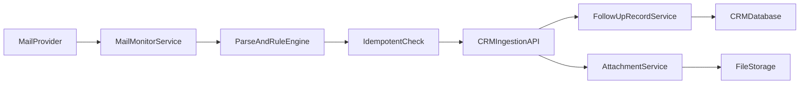

# 邮箱监测系统接入 CRM 实施方案

## 1. 目标

构建一个独立的“邮箱监测系统”，持续监测 **邮箱A 是否给邮箱B发送邮件**。  
当条件满足时，自动在 CRM 中创建一条跟进记录，并可选保存附件，做到可追溯、可重试、不重复入库。

---

## 2. 总体架构

推荐采用“**独立监测服务 + CRM 入库接口**”模式，不直接把长连接监听逻辑写进 CRM 主服务。



这样做的好处：
- 邮件监听是长连接 + 高 I/O，独立服务更稳定。
- CRM 专注业务入库，避免主系统被监听故障拖慢。
- 后续扩展多邮箱/多租户更容易。

---

## 3. 与现有项目的技术匹配原则

监测系统可以独立部署，但接口和数据结构必须对齐 CRM 现有实现：

- 后端风格：Spring Boot + MyBatis 风格
- 跟进记录入口：复用 CRM 的跟进新增业务能力
- 附件存储：复用 CRM 现有附件上传/转存机制
- 认证与权限：走内部服务鉴权（Token 或签名）

建议：
- 监测系统技术栈也使用 Java + Spring Boot，方便代码与模型一致；
- 若用其他语言也可，但接口契约必须严格一致。

---

## 4. 业务流程

## 4.1 监听与触发

1. 监测系统连接 MCP 邮箱服务（已授权邮箱A）
2. 持续获取新邮件事件（Push 优先，Poll 兜底）
3. 过滤规则：仅处理 `from = 邮箱A` 且 `to 包含 邮箱B` 的邮件

## 4.2 自动建跟进

1. 解析邮件元数据：messageId、threadId、subject、body、sendTime、附件清单
2. 根据邮箱地址匹配 CRM 联系人/客户
3. 生成跟进内容并调用 CRM 入库接口
4. 成功后回写“处理成功状态”；失败则重试

## 4.3 附件处理

1. 下载邮件附件到临时目录
2. 上传至 CRM 附件接口（或调用内部转存接口）
3. 将附件绑定到新建的跟进记录

---

## 5. 接口契约设计（建议）

监测系统调用 CRM 内部接口：

## 5.1 创建邮件跟进接口

- `POST /internal/mail/follow-record/create`

请求示例：

```json
{
  "organizationId": "org001",
  "sourceMailbox": "a@company.com",
  "targetMailbox": "b@company.com",
  "messageId": "<abc@mail>",
  "threadId": "thread-001",
  "subject": "报价确认",
  "contentText": "邮件正文纯文本...",
  "sendTime": 1760000000000,
  "fromAddress": "a@company.com",
  "toAddresses": ["b@company.com"],
  "ccAddresses": [],
  "attachmentIds": ["att001", "att002"]
}
```

响应示例：

```json
{
  "success": true,
  "followRecordId": "fr001",
  "deduplicated": false
}
```

## 5.2 附件上传接口

- 复用 CRM 现有附件临时上传 + 转存机制
- 转存时 `resourceId = followRecordId`

---

## 6. 幂等、防重、重试

## 6.1 幂等键

使用以下组合做唯一键：

- `organizationId + sourceMailbox + messageId`

数据库加唯一索引，代码层再校验一次，双保险防止重复建跟进。

## 6.2 重试策略

- 指数退避：1m -> 5m -> 15m -> 1h
- 超过最大重试次数进入死信队列
- 提供“按 messageId 手工重放”能力

---

## 7. 数据表建议（监测系统侧）

## 7.1 `mail_event`

用于存储原始邮件事件与处理状态：

- id
- organization_id
- source_mailbox
- target_mailbox
- message_id
- thread_id
- from_address
- to_addresses_json
- subject
- content_text
- send_time
- process_status（NEW/PROCESSED/FAILED/DEAD）
- follow_record_id
- error_message
- retry_count
- create_time
- update_time

唯一索引建议：

- `uk_org_mailbox_message(organization_id, source_mailbox, message_id)`

## 7.2 `mail_sync_cursor`

用于断点续传：

- mailbox
- cursor_token 或 last_uid
- last_sync_time
- update_time

---

## 8. 匹配 CRM 规则

客户匹配建议优先级：

1. 精确匹配联系人邮箱
2. 精确匹配客户主邮箱
3. 域名匹配 + 人工确认
4. 未匹配进入“待认领池”（不直接绑定客户）

注意：低置信度匹配不要自动落客户，避免错误跟进。

---

## 9. 安全与合规

- MCP 凭证加密存储，禁止明文写库
- 日志中不打印完整敏感正文
- 附件限制大小和类型（白名单）
- 保留审计字段：来源、操作者、处理时间

---

## 10. 监控与告警

必须有以下指标：

- 邮件拉取延迟
- 跟进创建成功率
- 附件上传成功率
- 幂等命中率（重复消息比例）
- 死信数量
- 监听断链时长

告警建议：

- 5 分钟失败率超过阈值告警
- 监听连接中断超过阈值告警
- 死信堆积超过阈值告警

---

## 11. 分阶段实施计划

## 阶段1（MVP）

- 支持一个授权邮箱
- 识别 A -> B 邮件事件
- 自动建跟进（先不处理复杂附件）
- 幂等防重 + 基础日志

## 阶段2

- 完整附件链路
- 重试/死信/补偿
- 待认领池
- 基础监控告警

## 阶段3

- 多邮箱多租户
- 邮件线程聚合（thread）
- 内容摘要与关键词分析

---

## 12. 联调验收标准

- 当邮箱A发给邮箱B邮件时，1分钟内产生一条 CRM 跟进记录
- 同一 messageId 不会重复创建记录
- 附件可在对应跟进中查看/下载
- 服务重启后可从断点继续同步
- 失败任务可重试并恢复

---

## 13. 开发前确认清单

开始编码前请确认以下信息：

- MCP 接口文档（拉取邮件、取附件、cursor）
- 已授权邮箱A与目标邮箱B
- CRM 中联系人/客户邮箱字段名
- 跟进方式字典是否已有 `EMAIL`
- 附件大小和类型限制
- 未匹配客户时的业务策略（待认领 or 未绑定跟进）

